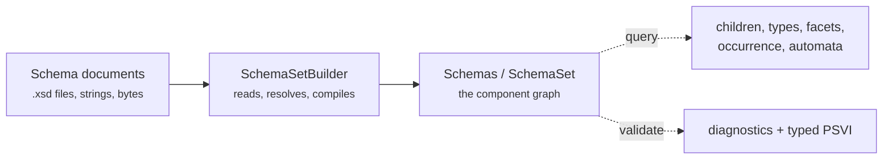

# The component model

## Three languages called XSD

When people say "XSD" they mean one of three things, and the difference is the
reason this library exists.

1. **Schema documents.** The XML you write: `<xs:element>`, `<xs:complexType>`,
   `xs:include`, `xs:import`. This is a *syntax*, and it is deliberately
   flexible — the same schema can be spelled a dozen ways, split across forty
   files, or fold a definition inline instead of naming it.
2. **Schema components.** The abstract graph those documents assemble into:
   type definitions, element declarations, attribute uses, particles, model
   groups, wildcards. Named and inline definitions become the same kind of
   thing. Forty files become one graph.
3. **Validation semantics.** The rules that decide whether a document is valid.

The specification defines every rule in the third layer against the **second**
one, never against the first. "Element Locally Valid (Complex Type)" is a
sentence about components, not about angle brackets.

So a tool that skips straight from documents to a verdict has to reconstruct
that middle layer internally — and then it throws it away. `xsdkit` builds it
and gives it to you.

!!! quote "The practical consequence"

    Questions like *"what may appear inside a `report`?"* are hard to answer
    from documents (the children could come from a base type three
    `xs:extension` steps up, or a `xs:group` reference, or a substitution
    group) and easy to answer from components. Every awkward part has already
    been resolved by the time you hold a `Schemas`.

## The lifecycle

There are exactly two states, and they are two types.



A `Schemas` never exists in a half-resolved state. There is no `Compile()` you
can forget to call, and no accessor that returns `None` because the graph is
not ready yet — a design mistake that .NET's `XmlSchemaSet` and several others
make, where you can query an unresolved schema and get quiet nonsense.

Building is the expensive step; querying is cheap. Build once, keep it, ask it
many questions. It is `Send + Sync`, so one compiled schema can serve every
thread, and the Python bindings release the GIL around the build.

## What a component graph contains

=== "Python"

    ```python
    schemas = xsdkit.SchemaSet.from_file("report.xsd")

    schemas.counts
    # {'types': 56, 'elements': 6, 'attributes': 12, 'particles': 7,
    #  'model_groups': 0, 'attribute_groups': 0,
    #  'identity_constraints': 0, 'notations': 0, 'annotations': 1}

    len(schemas)   # 6 — the globals *this* schema declares
    ```

=== "Rust"

    ```rust
    let counts = schemas.component_counts();
    println!("{} types, {} elements", counts.types, counts.elements);
    ```

Fifty-six types from a sixty-line schema, because **the 50 built-ins are real
components too**. `xs:string` is not a special case in a match arm somewhere —
it is a `SimpleType` with a variety, a primitive, facets and a base chain, and
it resolves exactly the way one of your own types does.

```python
schemas.type("http://www.w3.org/2001/XMLSchema", "string")
# <Type simple {http://www.w3.org/2001/XMLSchema}string>

[t.qname for t in schemas["{urn:example}Money"].base_chain]
# ['{urn:example}Money',
#  '{http://www.w3.org/2001/XMLSchema}decimal',
#  '{http://www.w3.org/2001/XMLSchema}anyAtomicType',
#  '{http://www.w3.org/2001/XMLSchema}anySimpleType',
#  '{http://www.w3.org/2001/XMLSchema}anyType']
```

The built-ins are excluded from `len()`, iteration and `in`, though — they are
in every schema set and would bury what your documents actually declared.
`schemas.type(...)` still finds them.

## Seven symbol spaces

XSD keeps seven separate namespaces for names. A type called `Item` and an
element called `Item` are unrelated components that never collide, and neither
does a model group of the same name.

| Symbol space | Declared by |
|---|---|
| Type | `xs:simpleType`, `xs:complexType` |
| Element | `xs:element` |
| Attribute | `xs:attribute` |
| Model group | `xs:group` |
| Attribute group | `xs:attributeGroup` |
| Notation | `xs:notation` |
| Identity constraint | `xs:key`, `xs:keyref`, `xs:unique` |

`xsdkit` keeps them apart. That is why lookups are per-kind — `schemas.element(...)`,
`schemas.type(...)`, `schemas.attribute(...)` — rather than one `get()` that
would have to guess which `Item` you meant.

Subscripting is the one convenience over that rule: `schemas["{urn:example}Item"]`
searches elements first, then types, because in practice a name is unambiguous
and typing the kind twice is friction. Where it matters, use the explicit
lookup.

## Global and local

Only **global** declarations — the direct children of `xs:schema` — are
addressable by name. A local element declared inside a complex type is a real
component with a real type, but it is scoped to that type, and two types may
each declare a `price` that means something different.

```python
report = schemas["{urn:example}report"]
report.is_global          # True

price = report["item"]["price"]
price.is_global           # False — it exists only inside Item
price.qname               # '{urn:example}price'
```

You reach locals by navigating to them, which is what `element["child"]` and
`type.children` are for.

## Names

A name is a pair — namespace and local part — not a string. Prefixes (`tns:`,
`xs:`) belong to the *document*; they are resolved away at load time and never
appear in the model. Two documents that use different prefixes for the same
namespace produce identical components.

For display and lookup, the pair is written in **Clark notation**:
`{urn:example}report`. Anywhere `xsdkit` takes a name in Python it accepts
Clark notation, a bare local name, or an explicit `(namespace, local)` pair.

```python
schemas["{urn:example}report"]          # Clark notation
schemas.element("urn:example", "report")  # explicit pair
report["item"]                            # local name, in the parent's namespace
```

Internally names are interned to `u32` ids, so comparing them is an integer
comparison rather than a string one — which matters when a content automaton
is comparing thousands of them per document.

## Annotations survive

`xs:documentation` and `xs:appinfo` are kept, not discarded.

```python
schemas["{urn:example}Sku"].doc
# 'Two letters, a dash, then four digits.'
```

`appinfo` is kept **verbatim**, as XML text, because it is where schema
families put the machine-readable conventions the standard never specified —
units, database mappings, UI hints. Summarising it would destroy exactly the
information someone reaching for it needs.

## Next

- [Loading schemas](loading.md) — getting documents into a `SchemaSet`.
- [Querying the model](querying.md) — what to ask it once you have one.
